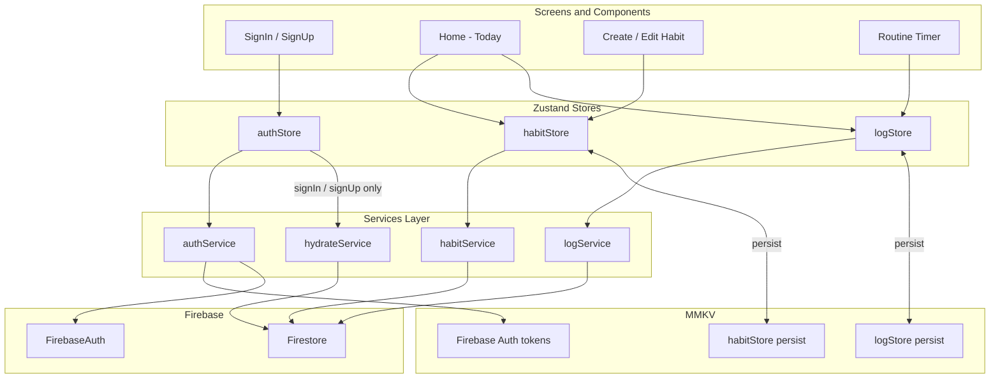
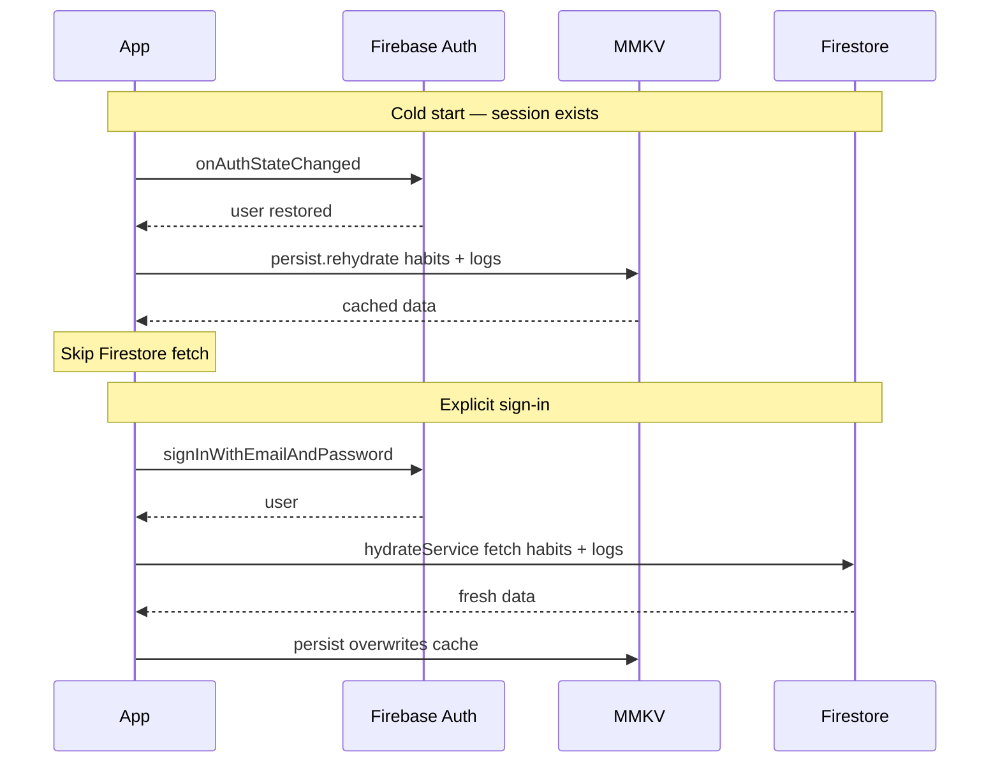

# FlowState V1 Implementation Plan

The repo is **greenfield** — only [`CLAUDE.md`](CLAUDE.md) exists today. This plan builds the full v1 habit tracker from scratch, following the spec's architecture and UI aesthetic. Sync strategy extends the spec with MMKV-backed Zustand persist (Firestore fetch on explicit sign-in only). Routine logs extend the spec with per-task `actualDurationSeconds`.

## Architecture overview



**Sync contract (updated for v1):**

- **Explicit sign-in / sign-up only:** fetch all user data from Firestore via `hydrateService` → overwrite `habitStore` + `logStore` → MMKV persist saves automatically
- **Auth session restore** (app relaunch with valid Firebase session): **skip Firestore read** — Zustand `persist` rehydrates `habitStore` + `logStore` from MMKV
- **No** `onSnapshot` / real-time listeners
- **Mutations:** Firestore write first → update Zustand on success → MMKV persist follows automatically
- **Sign-out:** clear in-memory stores + wipe user-scoped MMKV persist keys

---

## Phase 0 — Project scaffold

Initialize Expo with TypeScript, Expo Router, and the `src/` layout from the spec.

**Commands / setup:**

- `npx create-expo-app@latest . --template tabs` (or blank + add router) with TypeScript
- Restructure to `src/app/` for Expo Router screens
- Enable strict TypeScript in `[tsconfig.json](tsconfig.json)`
- Add `.gitignore` (include `.env`, `node_modules`, Expo artifacts)
- Add `[.env.example](.env.example)` for Firebase keys (no secrets committed)

**Dependencies:**

| Package                                            | Purpose                                                     |
| -------------------------------------------------- | ----------------------------------------------------------- |
| `expo-router`                                      | File-based navigation                                       |
| `firebase`                                         | Auth + Firestore (modular SDK)                              |
| `zustand`                                          | Global state                                                |
| `react-native-reanimated`                          | Completion animations (spec)                                |
| `react-native-mmkv` + `react-native-nitro-modules` | Synchronous local key/value storage (replaces AsyncStorage) |

**Local storage — [react-native-mmkv](https://github.com/mrousavy/react-native-mmkv):**

MMKV is fully synchronous (no async/await), ~30x faster than AsyncStorage, and uses JSI/Nitro Modules. Install via:

```bash
npx expo install react-native-mmkv react-native-nitro-modules
npx expo prebuild
```

**Expo caveat:** MMKV is a native module — requires a **development build** (`expo prebuild` + `expo run:ios` / `expo run:android`), not Expo Go. V4 requires React Native 0.76+; use a recent Expo SDK that satisfies this.

**Storage files to add:**

- `[src/storage/mmkv.ts](src/storage/mmkv.ts)` — singleton `createMMKV()` instance, exported as `storage`
- `[src/storage/firebasePersistence.ts](src/storage/firebasePersistence.ts)` — MMKV adapter for Firebase Auth (`getItem` / `setItem` / `removeItem`)
- `[src/storage/zustandStorage.ts](src/storage/zustandStorage.ts)` — MMKV adapter for Zustand `persist` middleware (`StateStorage` interface)

```typescript
// zustandStorage.ts (sketch) — per react-native-mmkv docs
import { storage } from "./mmkv";
import type { StateStorage } from "zustand/middleware";

export const zustandMMKVStorage: StateStorage = {
  getItem: (name) => storage.getString(name) ?? null,
  setItem: (name, value) => {
    storage.set(name, value);
  },
  removeItem: (name) => {
    storage.remove(name);
  },
};
```

**MMKV roles in v1:**

| Key namespace               | Purpose                                               |
| --------------------------- | ----------------------------------------------------- |
| Firebase Auth keys          | Session token persistence (via `firebasePersistence`) |
| `flowstate-habits-{userId}` | Zustand-persisted habits cache                        |
| `flowstate-logs-{userId}`   | Zustand-persisted logs cache                          |

Persist keys are **scoped by `userId`** so sign-out can wipe the correct user's cache without affecting other accounts on a shared device.

**Core files to create:**

```
src/
  app/
    _layout.tsx              # Root layout, auth gate, theme
    (auth)/
      sign-in.tsx
      sign-up.tsx
    (app)/
      _layout.tsx            # Tab or stack for authenticated area
      index.tsx              # Home — today's habits
      habit/
        new.tsx
        [id]/
          edit.tsx
      routine/
        [habitId].tsx        # Fullscreen step-through timer
  components/
    HabitCard.tsx
    CheckHabitCard.tsx
    CountHabitCard.tsx
    RoutineHabitCard.tsx
    ProgressRing.tsx
    CompletionSummary.tsx
    Button.tsx
    TextInput.tsx
  constants/
    theme.ts                 # Palette from CLAUDE.md
  hooks/
    useStoreHydration.ts     # Wait for Zustand persist rehydration before rendering app
  storage/
    mmkv.ts                  # Singleton MMKV instance
    firebasePersistence.ts   # MMKV → Firebase Auth persistence adapter
    zustandStorage.ts        # MMKV → Zustand persist adapter
    persistKeys.ts           # getHabitPersistKey(userId), getLogPersistKey(userId), clearUserPersist(userId)
  services/
    firebase.ts
    authService.ts
    habitService.ts
    logService.ts
    hydrateService.ts
  stores/
    authStore.ts
    habitStore.ts
    logStore.ts
  types/
    habit.ts
    log.ts
  utils/
    date.ts                  # todayString() → YYYY-MM-DD
    habitLogic.ts            # isCompleted, progress, accent helpers
```

---

## Phase 1 — Firebase project setup

You selected **no existing Firebase project** — include full setup.

**Firebase Console steps:**

1. Create project "FlowState" (disable Google Analytics if not needed)
2. Enable **Email/Password** auth provider
3. Create **Firestore** database (production mode)
4. Register a **Web app** to obtain config keys (works for Expo)
5. Copy config into `.env`:

- `EXPO_PUBLIC_FIREBASE_API_KEY`
- `EXPO_PUBLIC_FIREBASE_AUTH_DOMAIN`
- `EXPO_PUBLIC_FIREBASE_PROJECT_ID`
- `EXPO_PUBLIC_FIREBASE_STORAGE_BUCKET`
- `EXPO_PUBLIC_FIREBASE_MESSAGING_SENDER_ID`
- `EXPO_PUBLIC_FIREBASE_APP_ID`

`**[src/services/firebase.ts](src/services/firebase.ts)`:\*\*

- Initialize Firebase app from env vars
- Export `auth` and `db` (Firestore)
- Use `initializeAuth` with `getReactNativePersistence(firebasePersistence)` — backed by MMKV via the adapter in `[src/storage/firebasePersistence.ts](src/storage/firebasePersistence.ts)`, not AsyncStorage

`**[firestore.rules](firestore.rules)` + `[firebase.json](firebase.json)`:\*\*

- Scope all reads/writes to `request.auth.uid == resource.data.userId`
- Collections: `habits`, `habitLogs`
- Deploy via `firebase deploy --only firestore:rules` (document in README)

```javascript
// firestore.rules (sketch)
match /habits/{habitId} {
  allow read, write: if request.auth != null
    && request.auth.uid == resource.data.userId;
  allow create: if request.auth != null
    && request.auth.uid == request.resource.data.userId;
}
// Same pattern for habitLogs
```

---

## Phase 2 — Types and theme

`**[src/types/habit.ts](src/types/habit.ts)**` — mirror spec exactly:

- `Habit`, `RoutineTask`, `HabitType = 'check' | 'count' | 'routine'`
- `CreateHabitInput` / `UpdateHabitInput` for forms

**[`src/types/log.ts`](src/types/log.ts)** — extends CLAUDE.md spec for routine timing:

```typescript
interface CompletedRoutineTask {
  taskId: string;
  actualDurationSeconds: number; // elapsed time from step start → complete tap
}

interface HabitLog {
  id: string;
  habitId: string;
  userId: string;
  date: string; // YYYY-MM-DD
  completed: boolean; // check + routine habits (explicit completion flag)
  count?: number; // count habits
  completedTasks?: CompletedRoutineTask[]; // routine habits — historical step record
  loggedAt: Timestamp;
}
```

- `actualDurationSeconds` is wall-clock elapsed time, not the planned `durationSeconds` — user may finish early or late
- **Routine completion uses `log.completed`, not task-list matching** — habit `tasks` can be edited after a log exists; comparing `completedTasks` IDs to the current task list would give wrong results. Set `completed: true` when the user finishes the final step of that session
- `completedTasks` is a historical record of steps completed that day (with timings), not the source of truth for completion

`**[src/constants/theme.ts](src/constants/theme.ts)`\*\* — export palette from CLAUDE.md:

- `colors.primary`, `check`, `count`, `routine`, `background`, `surface`, `textPrimary`, `textSecondary`, `danger`
- Shared `borderRadius`, `spacing`, `typography` scales
- `getHabitAccent(type)` helper

---

## Phase 3 — Services layer

All Firebase access lives here. Screens/stores never import `firebase/*` directly.

| Service          | Functions                                                                              |
| ---------------- | -------------------------------------------------------------------------------------- |
| `authService`    | `signUp(email, pw)`, `signIn(email, pw)`, `signOut()`, `onAuthStateChanged`            |
| `habitService`   | `fetchHabits(userId)`, `createHabit(data)`, `updateHabit(id, data)`, `deleteHabit(id)` |
| `logService`     | `fetchLogs(userId)`, `upsertLog(data)` (one log per habit per date)                    |
| `hydrateService` | `hydrateUserData(userId)` — parallel fetch habits + logs, return both                  |

**Firestore document shapes** match spec fields. Use `serverTimestamp()` for `createdAt` / `loggedAt`.

**Log upsert strategy:** Query `habitLogs` where `habitId == X && date == today`; update existing doc or create new. Keeps one log per habit per day.

---

## Phase 4 — Zustand stores + MMKV persist

### [`authStore`](src/stores/authStore.ts)

- State: `user`, `isLoading`, `isAuthReady`
- Actions: `signIn`, `signUp`, `signOut`, `setUser`
- **`signIn` / `signUp`:** authenticate → call `hydrateService(userId)` → `habitStore.setHabits` + `logStore.setLogs` (overwrites MMKV cache)
- **`onAuthStateChanged` (session restore):** set `user` only — **do not** call `hydrateService`; `habitStore` + `logStore` rehydrate from MMKV via `persist` middleware
- **`signOut`:** Firebase sign-out → reset in-memory stores → `clearUserPersist(userId)` wipes MMKV keys

### [`habitStore`](src/stores/habitStore.ts) — with `persist`

```typescript
persist(
  (set, get) => ({ habits: [], setHabits, addHabit, ... }),
  {
    name: 'flowstate-habits',          // overridden at runtime with userId suffix
    storage: createJSONStorage(() => zustandMMKVStorage),
    skipHydration: true,               // manual rehydrate after userId known
  }
)
```

- State: `habits: Habit[]`
- Actions: `setHabits`, `addHabit`, `updateHabit`, `removeHabit`
- Async wrappers: Firestore first → update store → MMKV auto-persists

### [`logStore`](src/stores/logStore.ts) — with `persist`

- Same persist pattern as `habitStore`, key `flowstate-logs-{userId}`
- State: `logs: HabitLog[]`
- Selectors: `getLogForHabit(habitId, date)`, `getTodayLogs()`
- Async: `logCheck`, `incrementCount`, `completeRoutineStep` — Firestore first, then patch local state

### Rehydration gate

[`useStoreHydration`](src/hooks/useStoreHydration.ts) waits for both stores' `persist.rehydrate()` to finish before the auth gate renders the home screen. On session restore this gives instant UI from MMKV with no network call.



---

## Phase 5 — Habit logic utilities

`**[src/utils/habitLogic.ts](src/utils/habitLogic.ts)`\*\* — all completion/progress logic outside components:

| Function                                  | Behavior                                                                                                                                                |
| ----------------------------------------- | ------------------------------------------------------------------------------------------------------------------------------------------------------- |
| `isCheckCompleted(log)`                   | `log?.completed === true`                                                                                                                               |
| `isCountCompleted(habit, log)`            | `(log?.count ?? 0) >= habit.target`                                                                                                                     |
| `isRoutineCompleted(log)`                 | `log?.completed === true` — independent of current `habit.tasks`                                                                                        |
| `isHabitCompleted(habit, log)`            | dispatches by `habit.type`                                                                                                                              |
| `getCountProgress(habit, log)`            | `{ current, target, ratio }`                                                                                                                            |
| `getRoutineProgress(habit, log)`          | in-progress UI only: `{ completed: completedTasks.length, total: habit.tasks.length }`; if `log.completed`, treat as done regardless of task-list drift |
| `getTaskActualDuration(log, taskId)`      | returns `actualDurationSeconds` for a completed step, or `undefined`                                                                                    |
| `getRoutineTotalActualDuration(log)`      | sum of `completedTasks[].actualDurationSeconds` (for optional summary display)                                                                          |
| `getTodayCompletionSummary(habits, logs)` | `{ completed, total }` for home header — **not** multi-day streaks (explicitly out of scope)                                                            |

---

## Phase 6 — Auth UI and routing

**Expo Router auth gate** in [`src/app/_layout.tsx`](src/app/_layout.tsx):

- Subscribe to `onAuthStateChanged` on mount — session restore sets `user` only (no Firestore fetch)
- Wait for `useStoreHydration` (MMKV rehydrate) before rendering authenticated routes
- While `isLoading` → splash/loading screen
- Unauthenticated → `(auth)` group
- Authenticated → `(app)` group

**Screens:**

- **Sign In** — email + password, link to sign up, error display → on success calls `hydrateService` (Firestore fetch)
- **Sign Up** — email + password + confirm → on success calls `hydrateService` (Firestore fetch)

Style with dark theme + primary CTA buttons per palette. No OAuth.

---

## Phase 7 — Home screen (core UX)

`**[src/app/(app)/index.tsx](<src/app/(app)`/index.tsx>):\*\*

- Header: today's date + **CompletionSummary** ("3 of 5 done today")
- FlatList of `HabitCard` components, one per habit
- FAB or header button → navigate to `habit/new`
- Empty state with personality (illustration/copy, CTA to create first habit)

**Habit card interactions:**

| Type      | Tap behavior                                               |
| --------- | ---------------------------------------------------------- |
| `check`   | Toggle completed for today (animated checkmark pop, 200ms) |
| `count`   | Tap increments count; show `ProgressRing` with accent fill |
| `routine` | Navigate to `routine/[habitId]` fullscreen timer           |

**Completed card styling:** accent background at 0.15 opacity; incomplete uses `surface` + accent border/icon.

---

## Phase 8 — Habit CRUD (create / edit / delete)

You selected **full CRUD**.

**Create — `[habit/new.tsx](<src/app/(app)`/habit/new.tsx>):**

- Name input
- Type picker (check / count / routine) with distinct accent chips
- Conditional fields: `target` for count; dynamic task list (label + duration) for routine
- Save → `habitService.createHabit` → `habitStore.addHabit` → back to home

**Edit — `[habit/[id]/edit.tsx](<src/app/(app)`/habit/[id]/edit.tsx>):**

- Same form, pre-filled; type change allowed or locked (recommend **lock type** after creation to avoid log schema conflicts)
- Update → service → store

**Delete:**

- Danger-styled button on edit screen
- Confirm dialog → `habitService.deleteHabit` + delete associated logs → store cleanup

---

## Phase 9 — Routine timer (fullscreen)

**[`src/app/(app)/routine/[habitId].tsx`](<src/app/(app)/routine/[habitId].tsx>):**

- One task at a time, large label + countdown from planned `durationSeconds` (visual guide only)
- **Record `actualDurationSeconds` per step:** capture `stepStartedAt` when a step mounts; on "Complete step" compute `Math.round((Date.now() - stepStartedAt) / 1000)` and append to `completedTasks`
- After each step: `logStore.completeRoutineStep(habitId, { taskId, actualDurationSeconds })` → Firestore upsert → MMKV persist
- On **final step** of the session: set `completed: true` on the log (along with the last `completedTasks` entry) — this is what drives `isRoutineCompleted`, not matching task IDs
- Navigate back with satisfying animation
- Optional: show actual vs planned time on completed step (e.g. "1:23 / 2:00") — nice polish, not required for v1 logic
- Use `useEffect` + interval for countdown display; cleanup on unmount

**`completeRoutineStep` log shape** (appended to existing today's log):

```typescript
// mid-routine (step 1 of 3)
{ completed: false, completedTasks: [{ taskId: 'abc', actualDurationSeconds: 83 }] }

// final step — completed flag set explicitly
{ completed: true, completedTasks: [
  { taskId: 'abc', actualDurationSeconds: 83 },
  { taskId: 'def', actualDurationSeconds: 142 },
]}
```

If the user later edits the habit's task list, today's log stays `completed: true` with its original `completedTasks` history intact.

This is the most complex screen — build after check/count logging works.

---

## Phase 10 — Polish and quality

- **Animations:** Reanimated or Animated API for checkmark pop, count increment bounce, progress ring fill (150–250ms)
- **Loading/error states:** Disable buttons during Firestore writes; show inline errors
- **README:** Setup steps (env vars, Firebase rules deploy, `npx expo prebuild`, dev build via `expo run:ios` / `expo run:android`)
- **Manual test checklist** (see below)

---

## Build order (recommended)

```mermaid
flowchart LR
    P0[Scaffold] --> P1[Firebase]
    P1 --> P2[Types + Theme]
    P2 --> P3[Services]
    P3 --> P4[Stores]
    P4 --> P5[Utils]
    P5 --> P6[Auth UI]
    P6 --> P7[Home + Check]
    P7 --> P8[Count + Routine cards]
    P8 --> P9[Habit CRUD]
    P9 --> P10[Routine timer]
    P10 --> P11[Polish]
```



Ship incrementally: auth → home with check habits → count → routine → CRUD → animations.

---

## Explicitly out of scope (do not build)

Per `[CLAUDE.md](CLAUDE.md)` lines 154–160:

- Social features, push notifications
- Multi-day streak tracking or analytics history
- Offline writes / conflict resolution
- OAuth, magic links, social login

**Note:** The home screen "completion counter" means **today's ratio** (e.g. 3/5), not streak analytics.

---

## Manual test plan

- [ ] Sign up with email/password → lands on empty home
- [ ] Create check habit → tap to complete → card shows completed styling
- [ ] Create count habit (target 8) → tap increments → ring fills → completes at 8
- [ ] Create routine (3 steps) → timer advances through steps → `actualDurationSeconds` recorded per step
- [ ] Edit habit name/target/tasks → changes persist after sign-out/sign-in
- [ ] Delete habit → removed from home; logs cleaned up
- [ ] Explicit sign-in → fetches fresh data from Firestore, overwrites MMKV cache
- [ ] Kill and relaunch app → auth session + habits/logs restored from MMKV with **no Firestore read**
- [ ] Sign out → MMKV user cache cleared; sign in as same user → Firestore fetch repopulates cache
- [ ] Firestore rules reject cross-user access
